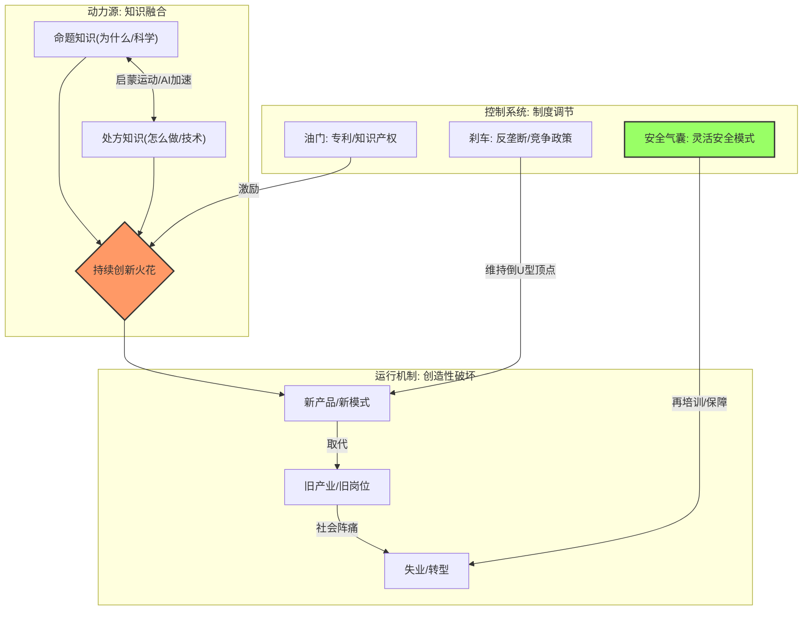

<iframe 
  width="700" 
  height="450" 
  src="https://www.youtube.com/embed/AEUBCul1MEo" 
  frameborder="0" 
  allow="accelerometer; autoplay; clipboard-write; encrypted-media; gyroscope; picture-in-picture" 
  allowfullscreen>
</iframe>

## 1. 概述 (Overview)

本视频内容深入剖析了人类经济增长的历史转折点与内在逻辑。核心话题围绕“为什么人类在经历了30万年的停滞后，在过去250年实现了爆发式增长”这一历史谜题展开。

内容结合了2025年诺贝尔经济学奖得主（乔尔·莫基尔、菲利普·阿吉翁、彼得·霍伊特）的理论，揭示了驱动现代经济繁荣的两大引擎：**“知识融合”**（理论与实践的结合）和**“创造性破坏”**（技术进步对旧结构的重塑）。

这一话题在当前具有极高的显著性，因为我们正处于人工智能（AI）引发的新一轮技术变革中。视频通过历史棱镜审视当下，探讨了AI如何将上述两种力量推向极致，并提出了借鉴“灵活安全”模式以应对AI时代社会挑战的制度想象力。

## 2. 关键问题 (Key Questions)

以下问题旨在引导对核心议题的进一步思考与探究：

1.  **逃离陷阱的关键**：250年前的启蒙运动时期，人类具体做对了什么，才得以集体逃离困扰了几十万年的“马尔萨斯陷阱”？
2.  **知识的化学反应**：莫基尔所提出的“命题知识”（为什么）与“处方知识”（怎么做）的融合，是如何将偶然的灵光一现转化为可自我迭代的创新系统的？
3.  **破坏的必然性**：如果不经历痛苦的“创造性破坏”，经济体是否真的无法实现长期的实质性增长？这种破坏的边界在哪里？
4.  **调节的艺术**：政府应如何精准运用“专利保护（油门）”和“反垄断（刹车）”，以维持市场处于创新活力最旺盛的“倒U型曲线”顶端？
5.  **AI时代的社会契约**：面对AI对知识工作者带来的前所未有的冲击，我们应如何设计新的社会制度（如“灵活安全”模式），以实现“保护人而不是保护岗位”的目标？

## 3. 主要发现 (Main Findings)

基于对字幕内容的分析，得出的核心洞见如下：

*   **增长是例外而非常态**：人类历史99.9%的时间处于停滞状态，最近250年的持续增长是一个需要特定条件维持的“奇迹”。
*   **创新的本质是连接**：工业革命的爆发并非单纯源于技术发明，而是源于科学家（理论家）与工匠（实干家）打破了阶层隔阂，实现了理论指导实践、实践反哺理论的正反馈循环（如“月光社”的案例）。
*   **增长引擎的运作机制**：
    *   **动力源**：创造性破坏。新技术必须推倒旧结构才能释放生产力（如Netflix取代百事达，汽车取代马车）。
    *   **调节器**：适度竞争。创新与竞争呈“倒U型”关系。完全垄断导致躺平，恶性竞争导致无利可图，只有在保持适度紧迫感与利润空间时，创新动力最强。
*   **AI的双重效应**：AI被视为历史逻辑的放大器：
    *   作为**知识融合机器**，它能以惊人的速度将理论转化为处方（如AlphaFold），潜力巨大。
    *   作为**创造性破坏引擎**，它将冲击波从蓝领扩展至白领和知识精英，社会痛感更强。

## 4. 比较分析 (Comparative Analysis)

| 维度 | 工业革命前/早期 | AI 时代 | 对比与张力 |
| :--- | :--- | :--- | :--- |
| **创新模式** | **经验驱动** 试错、运气、工匠直觉。 _“有工程学但没有力学”_ | **数据/智能驱动** AI将“为什么”与“怎么做”在高维空间强制融合。 _“不知疲倦的知识融合机”_ | AI极大地加速了从理论到应用的转化周期，但也可能导致人类对底层逻辑的理解脱节（黑盒化）。 |
| **破坏对象** | **体力/重复性劳动** 马车夫、手工艺人、实体租赁店。 _影响特定行业_ | **认知/创造性劳动** 数据分析师、程序员、甚至科研人员。 _影响全行业，包括“铁饭碗”_ | 破坏的范围更广、速度更快。以前的失业者可能只需体力转岗，现在的失业者面临认知技能的全面贬值。 |
| **应对策略** | **被动适应** 劳动者自行承担转型成本，或通过工会抗争。 | **制度性重构 (建议)** 借鉴“灵活安全”模式，政府介入再培训。 _“保护人而非岗位”_ | 传统福利体系可能无法应对AI时代的结构性失业，需要更主动、成本更高的社会干预机制。 |

## 5. 未来方向 (Next Directions)

*   **“灵活安全”的本土化研究**：深入研究丹麦/荷兰的Flexicurity模式在不同人口规模和文化背景国家（如中国、美国）的可行性与改造路径。
*   **AI与反垄断的新边界**：在AI赢家通吃的特性下，传统的“倒U型曲线”是否依然适用？如何定义AI时代的“适度竞争”？
*   **教育体系的重塑**：如果AI接管了大部分“处方知识”的执行，人类教育应如何转向以培养“提出好问题”和“制度想象力”为核心的能力？
*   **“停滞”的风险评估**：分析如果制度调节失灵（油门或刹车踩错），现代经济体重新滑落回停滞状态的具体路径和预警指标。

## 6. 术语表 (Glossary)

*   **马尔萨斯陷阱 (Malthusian Trap)**：一种历史常态，指技术进步带来的资源增加被人口增长所抵消，导致人均生活水平长期无法提高。
*   **处方知识 (Prescriptive Knowledge)**：关于“怎么做”的知识，如工艺流程、配方、操作指南。
*   **命题知识 (Propositional Knowledge)**：关于“为什么”的知识，如自然规律、科学原理、底层逻辑。
*   **创造性破坏 (Creative Destruction)**：约瑟夫·熊彼特提出的概念，指新陈代谢是经济发展的本质，旧产业的消亡是新产业诞生的必要代价。
*   **倒U型曲线 (Inverted U-Curve)**：描述市场竞争程度与创新能力之间关系的曲线。创新在适度竞争（既非垄断也非完全竞争）时达到峰值。
*   **灵活安全 (Flexicurity)**：源于北欧的一种劳动力市场模式，结合了劳动力市场的“灵活性”（企业易于雇佣/解雇）与劳动者的“安全性”（高福利失业救济与再培训）。

## 7. 视觉辅助 (Visual Aids)

### 经济增长引擎概念图

